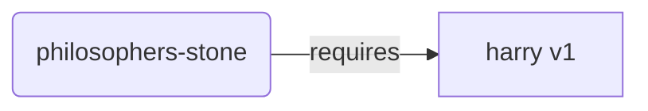
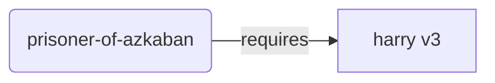
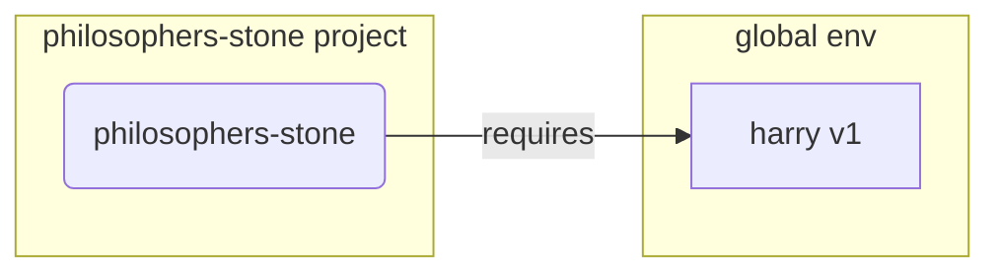
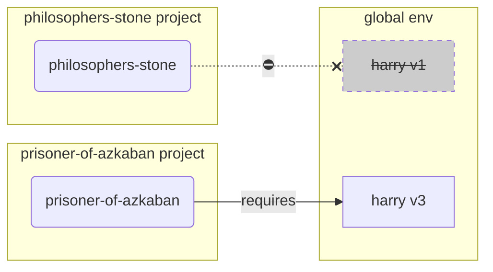
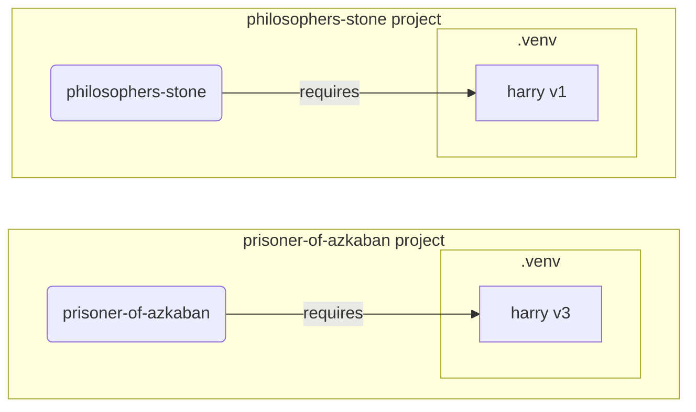

# Virtual Environments

These days, I recommend using [uv](https://github.com/astral-sh/uv) to manage Python projects, packages, and virtual environments.

It can create virtual environments, install packages, install Python versions, run tools, and manage full Python projects.

Still, it is useful to understand what virtual environments are and how they work underneath.

## The Short Version: Use `uv`

For a new project, you can let `uv` create and manage the project, its dependencies, and its virtual environment:

<div class="termy">

```console
$ uv init awesome-project --bare
$ cd awesome-project
$ uv add "fastapi[standard]"
$ uv run python main.py
```

</div>

You don't need to create or activate the virtual environment yourself. `uv` creates a `.venv` for the project and makes sure it is up to date whenever you use `uv run`.

The rest of this guide explains the lower-level concepts and commands. They are useful when debugging, working without `uv`, or understanding what `uv` manages for you.

## Virtual Environments Underneath

When you work on Python projects you should probably use a **virtual environment** (or a similar mechanism) to isolate the packages you install for each project.

/// note

If you already know about virtual environments, how to create them and use them, you probably don't need to read this. 🤓

///

/// tip

A **virtual environment** is different from an **environment variable**.

An **environment variable** is a variable in the system that can be used by programs.

A **virtual environment** is a directory with some files in it.

///

/// note

This page will teach you how to use **virtual environments** and how they work.

If you are ready to adopt a **tool that manages everything** for you (including installing Python), use [uv](https://github.com/astral-sh/uv).

///

## Create a Project

First, create a directory for your project.

What I normally do is create a directory named `code` inside my home directory.

And inside of that, I create one directory per project.

<div class="termy">

```console
// Go to the home directory
$ cd
// Create a directory for all your code projects
$ mkdir code
// Enter into that code directory
$ cd code
// Create a directory for this project
$ mkdir awesome-project
// Enter into that project directory
$ cd awesome-project
```

</div>

## Create a Virtual Environment

When you start working on a Python project **for the first time**, create a virtual environment **<dfn title="there are other options, this is a simple guideline">inside your project</dfn>**.

/// tip | Using `uv` as a project manager

If you use `uv` to manage the whole project, you don't need to create the virtual environment yourself.

Initialize the project and add its dependencies:

<div class="termy">

```console
$ uv init --bare
$ uv add httpx
```

</div>

`uv add` creates the project's `.venv` automatically and keeps it in sync with `pyproject.toml` and `uv.lock`.

The commands below are for creating a virtual environment manually.

///

/// tip

You only need to do this **once per project**, not every time you work.

///

//// tab | `venv`

To create a virtual environment, you can use the `venv` module that comes with Python.

<div class="termy">

```console
$ python -m venv .venv
```

</div>

/// details | What that command means

* `python`: use the program called `python`
* `-m`: call a module as a script, we'll tell it which module next
* `venv`: use the module called `venv` that normally comes installed with Python
* `.venv`: create the virtual environment in the new directory `.venv`

///

////

//// tab | `uv`

If you have [`uv`](https://github.com/astral-sh/uv) installed, you can use it to create a virtual environment.

<div class="termy">

```console
$ uv venv
```

</div>

/// tip

By default, `uv` will create a virtual environment in a directory called `.venv`.

But you could customize it by passing an additional argument with a directory name.

///

////

That command creates a new virtual environment in a directory called `.venv`.

/// details | `.venv` or other name

You could create the virtual environment in a different directory, but there's a convention of calling it `.venv`.

///

## Activate the Virtual Environment

Activate the new virtual environment so that any Python command you run or package you install uses it.

/// tip

Do this **every time** you start a **new terminal session** to work on the project.

///

//// tab | Linux, macOS

<div class="termy">

```console
$ source .venv/bin/activate
```

</div>

////

//// tab | Windows PowerShell

<div class="termy">

```console
$ .venv\Scripts\Activate.ps1
```

</div>

////

//// tab | Windows Bash

Or if you use Bash for Windows (e.g. [Git Bash](https://gitforwindows.org/)):

<div class="termy">

```console
$ source .venv/Scripts/activate
```

</div>

////

/// tip

Every time you install a **new package** in that environment, **activate** the environment again.

This makes sure that if you use a **terminal (<abbr title="command line interface">CLI</abbr>) program** installed by that package, you use the one from your virtual environment and not any other that could be installed globally, probably with a different version than what you need.

///

## Check the Virtual Environment is Active

Check that the virtual environment is active (the previous command worked).

/// tip

This is **optional**, but it's a good way to **check** that everything is working as expected and you are using the virtual environment you intended.

///

//// tab | Linux, macOS, Windows Bash

<div class="termy">

```console
$ which python

/home/user/code/awesome-project/.venv/bin/python
```

</div>

If it shows the `python` binary at `.venv/bin/python`, inside of your project (in this case `awesome-project`), then it worked. 🎉

////

//// tab | Windows PowerShell

<div class="termy">

```console
$ Get-Command python

C:\Users\user\code\awesome-project\.venv\Scripts\python
```

</div>

If it shows the `python` binary at `.venv\Scripts\python`, inside of your project (in this case `awesome-project`), then it worked. 🎉

////

## Upgrade `pip`

/// tip

If you use [`uv`](https://github.com/astral-sh/uv), you would use it to install things instead of `pip`, so you don't need to upgrade `pip`. 😎

///

If you are using `pip` to install packages (it comes by default with Python), you should **upgrade** it to the latest version.

Many exotic errors while installing a package are solved by just upgrading `pip` first.

/// tip

You would normally do this **once**, right after you create the virtual environment.

///

Make sure the virtual environment is active (with the command above) and then run:

<div class="termy">

```console
$ python -m pip install --upgrade pip

---> 100%
```

</div>

/// tip

Sometimes, you might get a **`No module named pip`** error when trying to upgrade pip.

If this happens, install and upgrade pip using the command below:

<div class="termy">

```console
$ python -m ensurepip --upgrade

---> 100%
```

</div>

This command will install pip if it is not already installed and also ensure that the installed version of pip is at least as recent as the one available in `ensurepip`.

///

## Add `.gitignore`

If you are using **Git** (you should), the files in `.venv` should be ignored by Git.

/// tip

[`uv`](https://github.com/astral-sh/uv) and Python 3.13 or newer create a `.gitignore` file in the virtual environment for you, so in most cases you can skip this step. 😎

///

If you created the virtual environment with an older Python version or another tool, check if `.venv/.gitignore` exists. If it doesn't, create it once with:

<div class="termy">

```console
$ echo "*" > .venv/.gitignore
```

</div>

/// details | What that command means

* `echo "*"`: will "print" the text `*` in the terminal (the next part changes that a bit)
* `>`: anything printed to the terminal by the command to the left of `>` should not be printed but instead written to the file that goes to the right of `>`
* `.gitignore`: the name of the file where the text should be written

And `*` for Git means "everything". So, it will ignore everything in the `.venv` directory.

That command will create a file `.gitignore` with the content:

```gitignore
*
```

///

## Install Packages

For a project, the recommended approach is to declare its dependencies in a `pyproject.toml` file and let [`uv`](https://docs.astral.sh/uv/) manage them.

### Add Packages to `pyproject.toml`

Add the packages your project needs with `uv add`:

<div class="termy">

```console
$ uv add httpx rich

---> 100%
```

</div>

This adds the dependencies to `pyproject.toml`, updates the `uv.lock` file with the exact resolved versions, and installs them in the project's virtual environment. You don't need to activate the environment first.

/// details | `pyproject.toml`

A `pyproject.toml` with these dependencies could look like:

```toml
[project]
name = "awesome-project"
version = "0.1.0"
dependencies = [
    "httpx>=0.28.1",
    "rich>=13.7.1",
]
```

You normally don't need to edit the dependency list manually because `uv add` does it for you.

///

### Install from `requirements.txt`

Some existing projects use a `requirements.txt` file instead of `pyproject.toml`. If you are working with one of those projects, you can install its packages after activating the virtual environment.

//// tab | `uv`

<div class="termy">

```console
$ uv pip install -r requirements.txt
---> 100%
```

</div>

////

//// tab | `pip`

<div class="termy">

```console
$ pip install -r requirements.txt
---> 100%
```

</div>

////

/// details | `requirements.txt`

A `requirements.txt` with some packages could look like:

```requirements.txt
httpx==0.28.1
rich==13.7.1
```

///

### Install a Package Without Declaring It

For quick experiments in an activated virtual environment, you can install a package without adding it to a project file:

<div class="termy">

```console
$ uv pip install httpx
---> 100%
```

</div>

For a real project, prefer `uv add` so the dependency is recorded in `pyproject.toml` and can be installed consistently elsewhere.

## Run Your Program

After you activated the virtual environment, you can run your program, and it will use the Python inside of your virtual environment with the packages you installed there.

<div class="termy">

```console
$ python main.py

Hello World
```

</div>

## Configure Your Editor

You would probably use an editor, make sure you configure it to use the same virtual environment you created (it will probably autodetect it) so that you can get autocompletion and inline errors.

For example:

* [VS Code](https://code.visualstudio.com/docs/python/environments#_select-and-activate-an-environment)
* [PyCharm](https://www.jetbrains.com/help/pycharm/creating-virtual-environment.html)

/// tip

You normally have to do this only **once**, when you create the virtual environment.

///

## Deactivate the Virtual Environment

Once you are done working on your project you can **deactivate** the virtual environment.

<div class="termy">

```console
$ deactivate
```

</div>

This way, when you run `python` it won't try to run it from that virtual environment with the packages installed there.

## Ready to Work

Now you're ready to start working on your project.


/// tip

Do you want to understand what all of that above is?

Continue reading. 👇🤓

///

## Why Virtual Environments

To work with Python projects you need Python and the packages your project depends on.

The recommended approach is to use [`uv`](https://docs.astral.sh/uv/) for both:

* Let `uv` find or download a suitable Python version automatically.
* Declare and install project packages with `uv add`.

You normally don't need to install Python separately. If you want to explicitly install or manage a specific Python version instead of using the default, you can optionally use `uv python install`.

`uv` creates and manages a virtual environment for each project, so its packages stay isolated automatically.

To understand why that isolation matters, consider what can happen when using `pip` without a virtual environment.

`pip` installs packages into a Python environment, but it does not create or select a separate environment for each project. If you use it without first creating and activating a virtual environment, it could install packages into your **global Python environment** (the global installation of Python).

### The Problem

So, what's the problem with installing packages in the global Python environment?

At some point, you will probably end up writing many different programs that depend on **different packages**. And some of these projects you work on will depend on **different versions** of the same package. 😱

For example, you could create a project called `philosophers-stone`. This program depends on another package called **`harry`, using the version `1`**. So, you need to install `harry`.



Then, at some point later, you create another project called `prisoner-of-azkaban`, and this project also depends on `harry`, but this project needs **`harry` version `3`**.



But now the problem is, if you install the packages globally (in the global environment) instead of in a local **virtual environment**, you will have to choose which version of `harry` to install.

If you used `pip` globally and wanted to run `philosophers-stone`, you would need to first install `harry` version `1`, for example with:

<div class="termy">

```console
$ pip install "harry==1"
```

</div>

/// warning

Don't run this command globally. It is here to illustrate the problem.

///

And then you would end up with `harry` version `1` installed in your global Python environment.



But then if you want to run `prisoner-of-azkaban`, you will need to uninstall `harry` version `1` and install `harry` version `3` (or just installing version `3` would automatically uninstall version `1`).

<div class="termy">

```console
$ pip install "harry==3"
```

</div>

/// tip

Again, this is an example of the problem, not the recommended workflow.

///

And then you would end up with `harry` version `3` installed in your global Python environment.

And if you try to run `philosophers-stone` again, there's a chance it would **not work** because it needs `harry` version `1`.



/// tip

It's very common for Python packages to try their best to **avoid breaking changes** in **new versions**, but it's better to be safe, and install newer versions intentionally and when you can run the tests to check everything is working correctly.

///

Now, imagine that with **many** other **packages** that all your **projects depend on**. That's very difficult to manage. And you would probably end up running some projects with **incompatible versions** of the packages, not knowing why something isn't working.

Also, depending on your operating system (e.g. Linux, Windows, macOS), it could have come with Python already installed. And in that case it probably had some packages pre-installed with some specific versions **needed by your system**. If you install packages in the global Python environment, you could end up **breaking** some of the programs that came with your operating system.

### How `uv` Avoids the Problem

With `uv`, each project declares its own dependencies and gets its own virtual environment:

<div class="termy">

```console
$ cd philosophers-stone
$ uv init --bare
$ uv add "harry==1"

$ cd ../prisoner-of-azkaban
$ uv init --bare
$ uv add "harry==3"
```

</div>

Now each project has its own `.venv`, `pyproject.toml`, and `uv.lock`. The two versions of `harry` don't conflict with each other, and `uv run` uses the correct environment for whichever project you are in.

## Where are Packages Installed

When you install Python, it creates some directories with some files on your computer.

Some of these directories contain all the packages you install.

As a lower-level example, when you run `pip` without a virtual environment:

<div class="termy">

```console
// Don't run this now, it's just an example 🤓
$ pip install httpx
---> 100%
```

</div>

That will download a compressed file with the HTTPX code, normally from [PyPI](https://pypi.org/project/httpx/).

It will also **download** files for other packages that HTTPX depends on.

Then it will **extract** all those files and put them in a directory on your computer.

It can put those downloaded and extracted files in a directory that belongs to that Python installation. That's the **global environment**.

When you use `uv add` in a project instead, `uv` installs the packages into that project's `.venv`, keeping them separate from the global environment and from other projects.

## What are Virtual Environments

The solution to the problems of having all the packages in the global environment is to use a **virtual environment for each project** you work on.

A virtual environment is a **directory**, very similar to the global one, where you can install the packages for a project.

This way, each project will have its own virtual environment (`.venv` directory) with its own packages.



/// tip

`uv` does this automatically for you.

///

## What Does Activating a Virtual Environment Mean

When you activate a virtual environment, for example with:

//// tab | Linux, macOS

<div class="termy">

```console
$ source .venv/bin/activate
```

</div>

////

//// tab | Windows PowerShell

<div class="termy">

```console
$ .venv\Scripts\Activate.ps1
```

</div>

////

//// tab | Windows Bash

Or if you use Bash for Windows (e.g. [Git Bash](https://gitforwindows.org/)):

<div class="termy">

```console
$ source .venv/Scripts/activate
```

</div>

////

That command will create or modify some environment variables that will be available for the next commands.

One of those variables is the `PATH` variable.

/// tip

You can learn more about the `PATH` environment variable in the [Environment Variables](environment-variables.md#path-environment-variable) guide.

///

Activating a virtual environment adds its path `.venv/bin` (on Linux and macOS) or `.venv\Scripts` (on Windows) to the `PATH` environment variable.

Let's say that before activating the environment, the `PATH` variable looked like this:

//// tab | Linux, macOS

```plaintext
/usr/bin:/bin:/usr/sbin:/sbin
```

That means that the system would look for programs in:

* `/usr/bin`
* `/bin`
* `/usr/sbin`
* `/sbin`

////

//// tab | Windows

```plaintext
C:\Windows\System32
```

That means that the system would look for programs in:

* `C:\Windows\System32`

////

After activating the virtual environment, the `PATH` variable would look something like this:

//// tab | Linux, macOS

```plaintext
/home/user/code/awesome-project/.venv/bin:/usr/bin:/bin:/usr/sbin:/sbin
```

That means that the system will now start looking first for programs in:

```plaintext
/home/user/code/awesome-project/.venv/bin
```

before looking in the other directories.

So, when you type `python` in the terminal, the system will find the Python program in

```plaintext
/home/user/code/awesome-project/.venv/bin/python
```

and use that one.

////

//// tab | Windows

```plaintext
C:\Users\user\code\awesome-project\.venv\Scripts;C:\Windows\System32
```

That means that the system will now start looking first for programs in:

```plaintext
C:\Users\user\code\awesome-project\.venv\Scripts
```

before looking in the other directories.

So, when you type `python` in the terminal, the system will find the Python program in

```plaintext
C:\Users\user\code\awesome-project\.venv\Scripts\python
```

and use that one.

////

An important detail is that it will put the virtual environment path at the **beginning** of the `PATH` variable. The system will find it **before** finding any other Python available. This way, when you run `python`, it will use the Python **from the virtual environment** instead of any other `python` (for example, Python from a global environment).

Activating a virtual environment also changes a couple of other things, but this is one of the most important things it does.

## Checking a Virtual Environment

When you check if a virtual environment is active, for example with:

//// tab | Linux, macOS, Windows Bash

<div class="termy">

```console
$ which python

/home/user/code/awesome-project/.venv/bin/python
```

</div>

////

//// tab | Windows PowerShell

<div class="termy">

```console
$ Get-Command python

C:\Users\user\code\awesome-project\.venv\Scripts\python
```

</div>

////

That means that the `python` program that will be used is the one **in the virtual environment**.

You use `which` in Linux and macOS and `Get-Command` in Windows PowerShell.

The way that command works is that it will check the `PATH` environment variable, going through **each path in order**, looking for the program called `python`. Once it finds it, it will **show you the path** to that program.

The most important part is that when you call `python`, that is the exact "`python`" that will be executed.

So, you can confirm if you are in the correct virtual environment.

/// tip

It's easy to activate one virtual environment, get one Python, and then **go to another project**.

And the second project **wouldn't work** because you are using the **incorrect Python**, from a virtual environment for another project.

It's useful to be able to check what `python` is being used. 🤓

///

## Why Deactivate a Virtual Environment

For example, you could be working on a project `philosophers-stone`, **activate that virtual environment**, install packages, and work with that environment.

And then you want to work on **another project** `prisoner-of-azkaban`.

You go to that project:

<div class="termy">

```console
$ cd ~/code/prisoner-of-azkaban
```

</div>

If you don't deactivate the virtual environment for `philosophers-stone`, when you run `python` in the terminal, it will try to use the Python from `philosophers-stone`.

<div class="termy">

```console
$ cd ~/code/prisoner-of-azkaban

$ python main.py

// Error importing sirius, it's not installed 😱
Traceback (most recent call last):
    File "main.py", line 1, in <module>
        import sirius
```

</div>

But if you deactivate the virtual environment and activate the new one for `prisoner-of-azkaban`, then when you run `python`, it will use the Python from the virtual environment in `prisoner-of-azkaban`.

<div class="termy">

```console
$ cd ~/code/prisoner-of-azkaban

// You don't need to be in the old directory to deactivate, you can do it wherever you are, even after going to the other project 😎
$ deactivate

// Activate the virtual environment in prisoner-of-azkaban/.venv 🚀
$ source .venv/bin/activate

// Now when you run python, it will find the package sirius installed in this virtual environment ✨
$ python main.py

I solemnly swear 🐺
```

</div>

## Alternatives

This is a simple guide to get you started and teach you how everything works **underneath**.

There are many **alternatives** to managing virtual environments, package dependencies (requirements), and projects.

Once you are ready and want to use a tool to **manage the entire project**, package dependencies, virtual environments, etc. I would suggest you use [uv](https://github.com/astral-sh/uv).

`uv` can do a lot of things, it can:

* **Install Python** for you, including different versions.
* Manage the **virtual environment** for your projects.
* Install **packages**.
* Manage package **dependencies and versions** for your project.
* Make sure you have an **exact** set of packages and versions to install, including their dependencies, so that you can run your project in production exactly the same way as on your computer while developing. This is called **locking**.
* And many other things.

## Conclusion

If you read and understood all this, now **you know much more** about virtual environments than many developers out there. 🤓

Knowing these details will most probably be useful in the future when you are debugging something that seems complex, because you will know **how it all works underneath**. 😎
